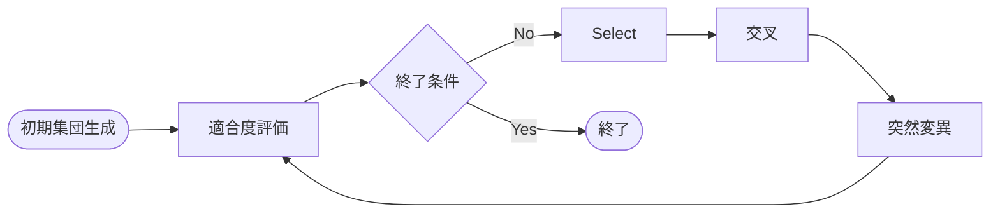
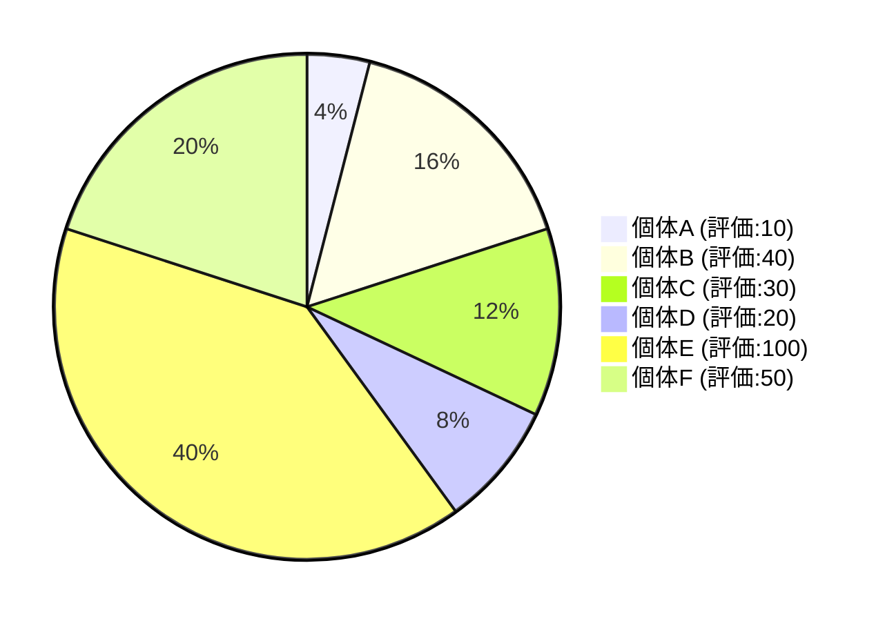

## はじめに
近年のGPUやCPUの高性能化に伴いCAEなどのシミュレーション分野の需要がますます増加してきた。しかし、解析の需要に対し、人の手作業による解析作業の見直しは需要に対して比例していないように見える。一度の解析で数時間〜数日以上の単位で時間がかかる上、パラメータ調整は人の感覚によるところが多い現実がある。そういった面倒なパラメータ調整を自動化する手法の一つに遺伝的アルゴリズム (Genetic Algorithm;GA) がある。GAとは、生物の進化（選択、交叉、突然変異）を模した最適化手法であれば、パラメータ調整をユーザーが指定した範囲で自動的に割り当てをおこないつつ、解析ソルバーを自動的に走らせ、あらかじめターゲット（目標）とする変数をしておくことで、自動的な評価まで行うことができる。この一連の流れを世代と言われる単位で集団を継承しつつ変異を繰り返すものである。


本稿のGAは、以下のようにアレンジしてある：
- 実数値GA（Real-coded genetic algorithm)を想定している。
- ソルバーとして、Scikit-learnで作成した応答局面モデルを使用し、ターゲット変数の値を得る。
	- 膨大な計算量をかけて高精度の結果を得られるソルバーに対し、その全てをソルバーで補うことは非効率であることが問題として挙げられる。そこで応答局面とソルバーとのハイブリッドGAの提案を行いたいが、先行研究を見つけたので、後々実装をしたいと考えている[9]
- 複数ターゲット変数を対象とできるように、最終的な評価に残差平方和を使用しており、最終的には単目的GAとして動作する。
- 突然変異の代わりに、世代交代モデル（エリートやMGGなど）を採用している。


> [!caution]
> 現在編集中ですので、随時更新していきます。(2026/04/11)


## GAの仕組み
GAは1975年にHolland氏によって考案された手法で、以下の図のような流れに沿って適応を繰り返し、最適化に近づいていく。





1. 初期集団（第0世代）の生成
	- あらかじめ決めた個体数（N）個体が含まれる集団をランダムに生成する。（初期集団）
2. 適応度の評価
	- 各個体に対して評価関数を使用して評価を計算する
3. 終了条件を判定する（世代交代の終了や、適応度が一定以上あるなど）
	- Yes -> 終了
	- No -> 次世代集団の生成
4. 次世代の生成(世代交代モデルによって違いが出る)
	1. 生成されていた前世代から親を”選択”する
	2. 選択された親を元に”交叉”い新たな個体を生成する
	3. 交差された個体に”突然変異”を行う
5. 1-4を繰り返す


次に、個別に1〜3のプロセスについて説明を行う。順序が異なるが2の適応度の評価に関する説明は最後に行う。


### 初期集団の生成
まずは、初期集団（第0世代）の生成にではGAの出発地点を決める重要なフェーズであり、偏りのある質の低い個体を使用してしまうことで、最適化への収束が悪くなったり、最適解を見つけることができなかったりする。


そのため、探索空間全体を探索するために分布した個体を生成することで、局所解ではなく、最適解を見つけることに近づくことができる。
また、無駄な計算を避けることで、ソルバーで時間のかかる計算をしてしまい、リソースと時間を効率化することもできる。


良質な個体を作るために、[[Latin Hypercube Sampling (LHS) の理論と有用性]]などが挙げられる。
これは別ページで解説する。


### 次世代の生成
#### 選択 (Selection)
GAでは交叉や対象と選択するというプロセスが何度も生じる。そのときに、一様分布したランダム関数では、個体差を恣意的に作り出すことができない。そのような選択に”差”を作るための手法が様々提唱されているので以下に紹介する。


##### ルーレット法
よく、ゲームのルーレットを選択する方法として表現される。それぞれの個体の評価値に基づいて円グラフ上に割り当てがされる。
しかし、評価値が良好な個体ほど選択されやすく、そうでない個体は選択されにくいランク付けがされる[3]。


以下に簡単な例を提示する。
以下のテーブルがあり、評価が最も良い個体を優良個体としたときの例である。

| ID  | 個体 | 評価 | 累積和 | 確率（評価値/累積和の結果） |     |
| --- | ---- | ---- | ------ | --------------------------- | --- |
| 0   | A    | 10   | 10     | 0.04                        |     |
| 1   | B    | 40   | 50     | 0.16                        |     |
| 2   | C    | 30   | 80     | 0.12                        |     |
| 3   | D    | 20   | 100    | 0.08                        |     |
| 4   | E    | 100  | 200    | 0.4                         |     |
| 5   | F    | 50   | 250    | 0.2                         |     |


**ルーレット選択：個体別占有率（選択確率）**



ただし、ルーレット法には、特定の個体だけが選択されやすく、局所解に陥りやすい欠点がある。
また、このルーレット法を改善したものにランキング法がある。


##### トーナメント法
トーナメント法は、非常にシンプルで、トーナメントサイズkを指定し、k個を現在の集団からランダムに選択する。その中から最も評価の良い個体を選択する。この操作を任意の回数繰り返す手法である。トーナメントサイズkは2に設定されることが多い[4]。


#### 交叉 (Crossover)
交叉とは、複数の親子対を掛け合わせることで、新たな個体を生成することを指す。BLX-α、SPX、REXなどの手法が代表的である。


##### BLX-α
GAの交叉において、複数パラメータを持つ個体同士を掛け合わせる際、標準的に用いられる手法の一つが **BLX-$\alpha$** である。
この手法は、親となる2つの個体が持つパラメータの間だけでなく、その周辺領域まで探索範囲を広げる点に特徴がある。


交叉させる2つの親個体を $P_1, P_2$ とします。それぞれの個体は $n$ 個のパラメータを持つベクトルとして表される。

$$P_1 = (p_1^1, \dots, p_n^1), \quad P_2 = (p_1^2, \dots, p_n^2)$$

このとき、BLX-$\alpha$ は2つの子個体 $C_k = (c_1^k, \dots, c_n^k) \quad (k=1,2)$ を生成する。各次元のパラメータ $c_i^k$ は、以下の手順で決定される。


各パラメータ $i$ において、2つの親のパラメータ値から最大値 $p_{\max}$、最小値 $p_{\min}$、およびその差（距離） $d$ を求める。

- $p_{\max} = \max \{p_i^1, p_i^2\}$
    
- $p_{\min} = \min \{p_i^1, p_i^2\}$
    
- $d = p_{\max} - p_{\min}$
    

ハイパーパラメータ $\alpha$ を用いて、探索範囲を親の距離 $d$ の $\alpha$ 倍だけ外側に拡張する。
また、ハイパーパラメータ　$\alpha$ は一般的に、0.5が良いと言われているが、場合によっては0.3の方が良い場合がある[6]。

- **探索区間**: $[p_{\min} - \alpha d, \ p_{\max} + \alpha d]$
    
この拡張された区間内から、一様乱数によってランダムに新しいパラメータ値を選択します。

$$c_i^k \sim \text{Uniform}(p_{\min} - \alpha d, \ p_{\max} + \alpha d)$$

#### 世代交代モデル
GAにおいて重要になってくるのが、交叉と淘汰をどのようにコントロールするかである。上記で説明した選択法、交叉法を使用し、それらをシステムとして落とし込んだものが世代交代モデルである。代表的なものに、エリート戦略、Minimal Generation Gap (MGG)である。


##### エリート戦略
エリート戦略とは、現世代の最良個体（エリートサイズk個）を必ず次世代に継承させる。選択法にはトーナメント法、ルーレット法、ランキング法が使われる[7]。世代交代のフローは以下の図のように行われる。


 ```mermaid
 graph TD
    Start([初期集団の生成]) --> Eval[適合度の評価]
    Eval --> Stop{収束条件を満たすか?}
    Stop -- No --> Elite[エリート個体の選抜・保存]
    Stop -- Yes --> End([最適解の出力])
    Elite --> Select[選択: 次世代の親を選ぶ]
    Select --> Replace[次世代集団の形成]
    Replace --> Recover[保存していたエリートを戻す次世代集団とする]
	Recover --> Eval
 ```  


ただし弱点として、恣意的に優良個体を次世代に入れることにより、最適解の早期収束が起こり、局所解に陥りやすい。


##### Minimal Generation Gap (MGG)
MGGの選択法にはルーレットの方が選択される。探索序盤における選択圧を下げ、初期収束を回避する。また、後半の集団内にて多様な個体を生存させやすく進化的停滞を抑制することが意図されたモデルである[8]。

詳しいフローは以下のとおりである。


 ```mermaid
 graph TD
    Start([初期集団の生成]) --> Eval[適合度の評価]
    Eval --> Stop{収束条件を満たすか?}
    Stop -- Yes --> End([最適解の出力])
    Stop -- No --> FirstSelect[現世代からランダムに2個体選択し集団Cとし、その個体を差し引かれた親集団をPとする]
    FirstSelect --> X[選択された2個体からt個体生成し集団C'とする]
    X --> SecondSelect[集団CとC'の中から最良個体を1つ選択し、Pに戻す]
    SecondSelect --> ThirdSelect[集団CとC'の中から確率的に1個体選択肢、Pに戻し、Pを次世代集団とする]
	ThirdSelect --> Eval
 ```  


### 適応度の評価
残差平方和は、統計学や機械学習において、モデルの予測値と実際の観測値の誤差を定量化する指標である。

実測値を $y_i$、モデルによる予測値を $\hat{y}_i$ とすると、RSSは以下の式で定義される：

$$RSS = \sum_{i=1}^{n} (y_i - \hat{y}_i)^2$$

RSSの値が小さければ小さいほど良質な個体とここでのGAでは定義する。


問題点として、複数のターゲット変数がある場合に、ある一つのターゲットだけ、過学習が進んでしまうと、他のターゲット変数の評価が甘くなり、ターゲット変数全体を改善したい場合などにノイズとなり得る。


## References
[1] kanekanekaneko, “遺伝的アルゴリズムの代表的な選択方式の紹介およびそれらの性質について,” _Qiita_, Jun. 12, 2025. https://qiita.com/kanekanekaneko/items/1c563ece591fd2ba2127 (accessed Apr. 04, 2026).

[2] 化学とインフォマティクスと時々雑記, “【初心者向け】遺伝的アルゴリズムについてわかりやすく解説,” _化学とインフォマティクスと時々雑記_, Sep. 03, 2024. https://boritaso-blog.com/genetic_algorithm/ (accessed Apr. 04, 2026).

[3]　“Algorithms in Nature Genetic algorithms.” Available: https://www.cs.cmu.edu/~02317/slides/lec_8.pdf

‌[4] D. Goldberg and K. Deb, “A Comparative Analysis of Selection Schemes Used in Genetic Algorithms.” Available: https://www.cse.unr.edu/~sushil/class/gas/papers/Select.pdf

[5]　小野 功, 山村 雅幸, and 喜多 一, “実数値GAとその応用,” _人工知能_, vol. 15, no. 2, pp. 259–266, Mar. 2000, doi: https://doi.org/10.11517/jjsai.15.2_259.

[6]　F. Herrera, M. Lozano, E. Pérez, A. M. Sánchez, and P. Villar, “Multiple Crossover per Couple with Selection of the Two Best Offspring: An Experimental Study with the BLX-alpha Crossover Operator for Real-Coded Genetic Algorithms.,” _Lecture Notes in Computer Science_, pp. 392–401, Nov. 2002, doi: https://doi.org/10.1007/3-540-36131-6_40.

[7]　_Algorithmafternoon.com_, Apr. 17, 2024. https://algorithmafternoon.com/genetic/elitist_genetic_algorithm/ (accessed Apr. 05, 2026).

[8] 佐藤 浩, 小野 功, and 小林 重信, “遺伝的アルゴリズムにおける世代交代モデルの提案と評価,” _人工知能_, vol. 12, no. 5, pp. 734–744, Sep. 1997, doi: https://doi.org/10.11517/jjsai.12.5_734.

[9] P. Singh, H. Gupta, O. Vinayak, and A. Tyagi, “Application of Response Surface Method and Genetic Algorithm in the Design of High-Efficiency Prototype Vehicle,” 2023. Accessed: Apr. 11, 2026. [Online]. Available: https://arxiv.org/pdf/2311.04308
